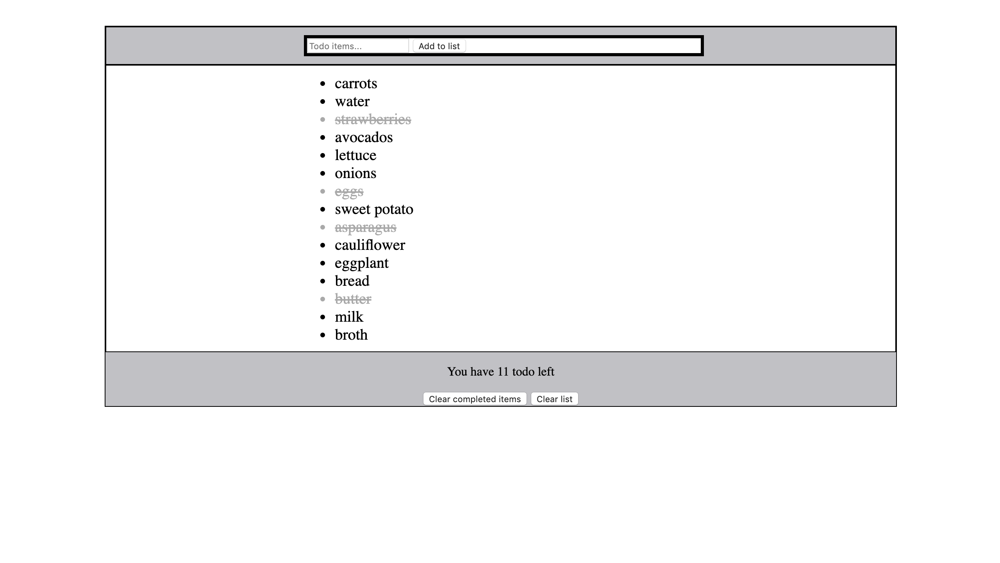

# ✅ Awesome: Todo List

https://infallible-meninsky-eb1e88.netlify.com

### Tech Used: HTML5, CSS3, Javascript
Here I have a completely responsive Todo List. This Todo list allows user to input task/items that they want to complete.  They will then be able to cross completed items of.  They than can chooses to clear the completed items and then clear the complete list. 

